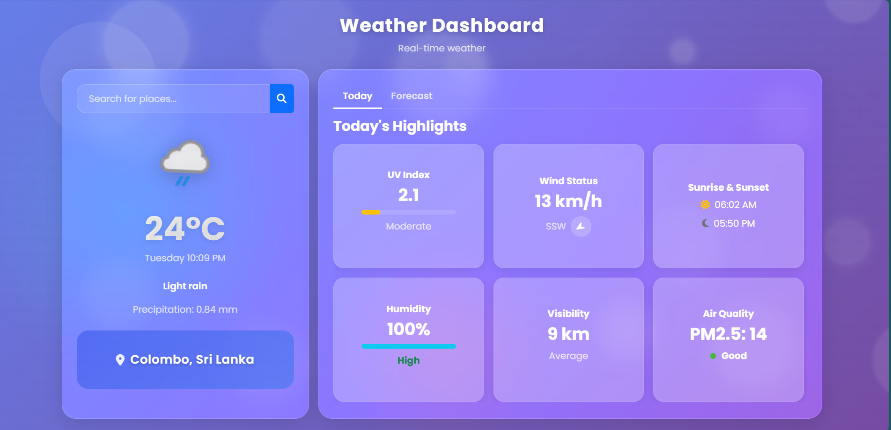

# 🌤️ Liquid Glass Weather Dashboard

A beautiful, modern weather dashboard with glassmorphism design that provides real-time weather information and forecasts.

  

## ✨ Features

- **🌤️ Real-time Weather Data** - Current conditions, temperature, and atmospheric data
- **📅 7-Day Forecast** - Extended weather predictions with visual icons
- **🎨 Glassmorphism UI** - Modern glass-like design with floating animations
- **🌍 Location Search** - Search for weather in any city worldwide
- **📱 Responsive Design** - Works perfectly on desktop, tablet, and mobile
- **🎯 Interactive Elements** - Hover effects and smooth transitions
- **🌈 Dynamic Background** - Animated bubbles and gradient effects

## 🚀 Live Demo

[View Live Demo](https://weather-app-nine-nu-or1hzq16s1.vercel.app/)

## 🛠️ Installation

### Prerequisites
- Modern web browser with JavaScript enabled
- WeatherAPI account (free tier available)

### Quick Start

1. **Clone the repository**
```bash
git clone https://github.com/yourusername/weather-dashboard.git
cd weather-dashboard
```

2. **Get API Key**
   - Sign up at [WeatherAPI.com](https://www.weatherapi.com/)
   - Get your free API key
   - Replace the API key in `assets/js/script.js`:
   ```javascript
   const WEATHERAPI_KEY = '58f884011b86402f988144734251711';
   ```

3. **Open in browser**
```bash
# Simply open index.html in your browser
open index.html
```

### Development Setup

For local development with live reload:

```bash
# Using Python (if installed)
python -m http.server 8000

# Using Node.js http-server
npx http-server

# Using PHP
php -S localhost:8000
```

Then visit `http://localhost:8000`

## 📁 Project Structure

```
weather-dashboard/
├── index.html                 # Main HTML file
├── assets/
│   ├── css/
│   │   └── style.css         # Main stylesheet
│   ├── js/
│   │   └── script.js         # JavaScript functionality
│   └── images/               # Static images (if any)
├── README.md                 # This file
└── LICENSE                   # MIT License
```

## 🎯 Usage

### Basic Navigation
1. **Current Weather Tab**: View real-time weather data including:
   - Temperature and conditions
   - UV Index with progress indicator
   - Wind status with direction
   - Sunrise and sunset times
   - Humidity levels
   - Visibility
   - Air quality index

2. **Forecast Tab**: 
   - 7-day weather forecast
   - Temperature ranges
   - Weather conditions with icons
   - Additional metrics (humidity, wind, rain chance)

### Search Functionality
- Type any city name in the search bar
- Press Enter or click the search icon
- View updated weather information instantly

## 🔧 Configuration

### API Configuration
The dashboard uses WeatherAPI. Update the API key in the JavaScript file:

```javascript
const WEATHERAPI_KEY = 'your-actual-api-key';
const DEFAULT_CITY = 'Colombo'; // Change default city if needed
```

### Customization Options

**Colors & Theme:**
```css
:root {
  --primary: #4361ee;      /* Main blue color */
  --secondary: #3f37c9;    /* Darker blue */
  --accent: #4cc9f0;       /* Light blue accent */
  --card-bg: rgba(255,255,255,0.18); /* Glass effect opacity */
}
```

**Animation Settings:**
- Modify bubble count and animation speed in `createBubbles()` function
- Adjust floating animation duration in CSS

## 🌐 API Reference

This project uses [WeatherAPI.com](https://www.weatherapi.com/) with the following endpoints:

- **Current Weather**: `/v1/current.json`
- **Forecast**: `/v1/forecast.json`
- **Parameters**: `q={location}&days=7&aqi=yes`

### Response Data Used
- Location data (name, country, localtime)
- Current conditions (temp, humidity, wind, visibility)
- Air quality index
- Forecast data (7 days)
- Astronomical data (sunrise, sunset)

## 🎨 Design Features

### Glassmorphism Effect
```css
.glass-effect {
  background: rgba(255, 255, 255, 0.18);
  backdrop-filter: blur(15px) saturate(180%);
  border: 1px solid rgba(255, 255, 255, 0.18);
}
```

### Animations
- Floating weather icons
- Animated background bubbles
- Smooth hover transitions
- Progress bar animations

### Responsive Breakpoints
- **Desktop**: 1200px+
- **Tablet**: 768px - 1199px  
- **Mobile**: 320px - 767px

## 🐛 Troubleshooting

### Common Issues

**1. Weather data not loading**
- Check API key is valid and active
- Verify internet connection
- Check browser console for errors

**2. Search not working**
- Ensure JavaScript is enabled
- Check for ad blockers interfering with API calls

**3. Layout issues**
- Clear browser cache
- Check CSS file is loading properly

**4. Bubbles not animating**
- Verify CSS animations are supported by browser
- Check for JavaScript errors

### Browser Compatibility
- ✅ Chrome 90+
- ✅ Firefox 88+
- ✅ Safari 14+
- ✅ Edge 90+

## 🤝 Contributing

We love contributions! Here's how to help:

1. Fork the project
2. Create a feature branch (`git checkout -b feature/AmazingFeature`)
3. Commit your changes (`git commit -m 'Add some AmazingFeature'`)
4. Push to the branch (`git push origin feature/AmazingFeature`)
5. Open a Pull Request

### Development Guidelines
- Follow existing code style
- Test on multiple browsers
- Update documentation as needed
- Use meaningful commit messages

## 📝 Changelog

### v1.0.0 (Current)
- Initial release
- Real-time weather data
- 7-day forecast
- Glassmorphism design
- Responsive layout

## 🏆 Acknowledgments

- **Weather Data**: [WeatherAPI.com](https://www.weatherapi.com/)
- **Icons**: [Font Awesome](https://fontawesome.com)
- **Fonts**: [Google Fonts - Poppins](https://fonts.google.com)
- **UI Framework**: [Bootstrap 5](https://getbootstrap.com)

## 📄 License

This project is licensed under the MIT License - see the [LICENSE](LICENSE) file for details.

---

<div align="center">

**Made with ❤️ and ☕**

*If you find this project helpful, please give it a ⭐!*

</div>
